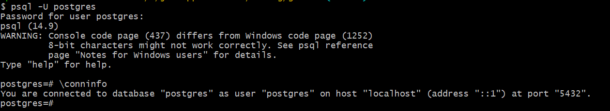
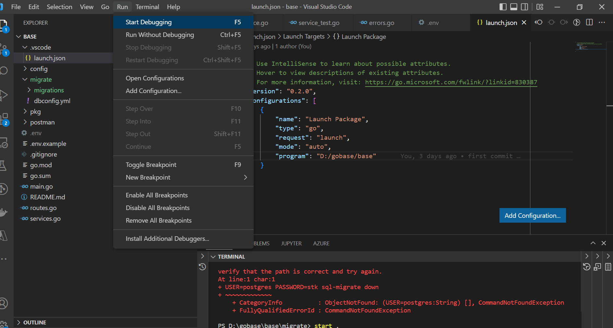
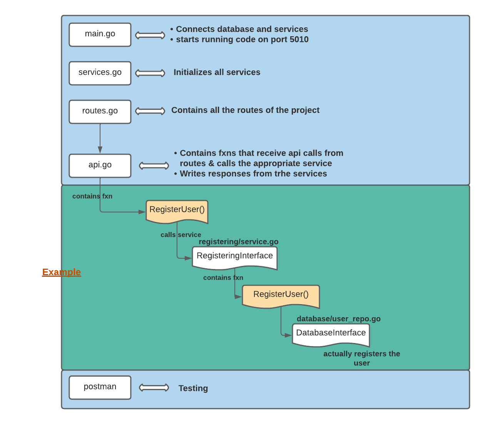
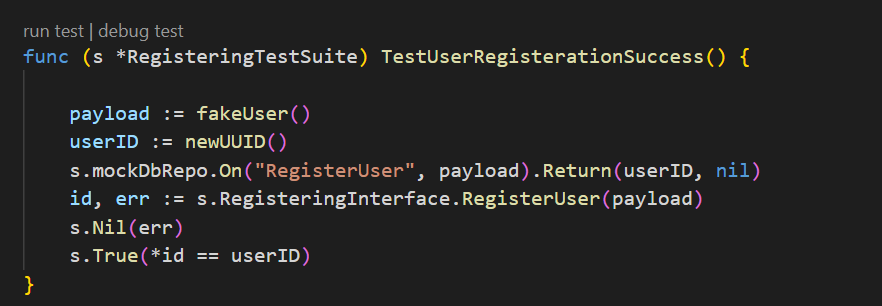

# Golang Base Project

## Packages and Resources

- Golang 1.17 or above
- Git
- PostgreSQL
- SQL-MIGRATE tool
- Postman
- VSCode

NB: All commands below should be run on git bash or any bash supported terminal.

### Setup

1. Download and install git from [here](https://git-scm.com/downloads). This should also install git bash which can be opened from the start menu.
2. Download and Install PgAdmin 4 from [here](https://www.pgadmin.org/download/). This should come with postgresql and should automatically run after install on port 5432. Make sure to take note of your passwords, there should be a PgAdmin password and the default user password. After install, open git bash and run the following commands to check if postgres is running on same port

- Connect user (use the default username, should be postgres if not changed)

```
psql -U postgres
```

- Check connection status

```
\conninfo
```

You should see output similar to the below \


- Start PgAdmin from windows start menu and input your passwords.
- Create a database called `godb` with the user postgres.

3. Install latest Golang 1.\*. Download the variant for your operating system [here](https://go.dev/doc/install)

- After install, open git bash and type the command below to see if you get the help page

```
go version
```

4. install ginkgo

```
go install github.com/onsi/ginkgo/v2/ginkgo
```

Open terminal/command line and try the command below and you should see the output.

```
ginkgo version
```

5. Clone this repository

```
git clone https://gitlab.com/clasence/gobase.git
```

6. Go to root directory and run this command to install go pakages.

```
go mod tidy
```

7. Make a copy of the .env.example and rename it to .env
8. Update the connection string on line 1 to include your postgres username and password (update the uppercase fields below )

```
CONNECTION_STRING=host=localhost port=5432 user=USERNAME dbname=godb password=PASSWORD sslmode=disable
```

9. Go into the .vscode/launch.json file the `program` on line 4 to the full path to the project's root.

10. On VSCode, top left, select `run` and `start debugging`
    

11. Install postman and create an account. Download from [here](https://www.postman.com/downloads/).

12. Import the json filed in `/postman/gobase.postman_collection.json` into postman.

13. Update the variables to localhost:5010
    

Run the postman test `Add User Success` and it should be successful.

## Development

### Overview



### File structure

**--migrate**
&nbsp;&nbsp;--migrations/ file contains all migrations
&nbsp;&nbsp;--dbconfig.yml file contains configuration for sql-migrate tool.

--**pkg**
&nbsp;&nbsp; **--api** functions which receive the api calls from the routes and calls the services. They also write the responses from the services.
&nbsp;&nbsp; **--database** functions to connect to the database and perform any db operation.
&nbsp;&nbsp; **--models** all database models used to connect to the database.
&nbsp;&nbsp; **--registering, ...ing** Folders ending in `ing` are the services which have all the business logic. They have the **service.go** file which has the logic and the **service_test.go** file which has the tests of the logic. The **errors.go** file contains all the errors. The rest of the folders contain structs used in the business logic.
&nbsp;&nbsp; **--postman** This contains the postman tests
&nbsp;&nbsp; **--.env.example** This contains all the variables which are application secrets. To run the code, you will have to create a `.env` file from this file and change all the variables to the ones you use locally.
&nbsp;&nbsp; **--main.go** The main file which connects to db and services and also starts running the code on the specified port (5010) in this case.
&nbsp;&nbsp; **--services.go** This file initializes all services.
&nbsp;&nbsp; **--routes** This file contains all the routes of the project.

### Testing

Ideally, all services in the project should have a `service_test.go`. To run each test from vscode, open the file and click on the `run test` or run `go test ./...` from the root folder.


